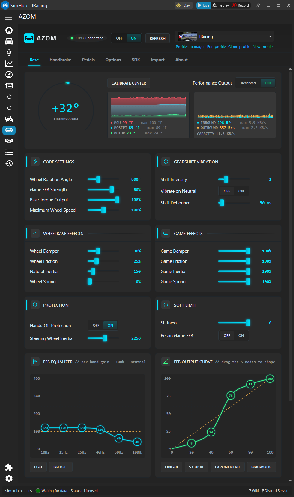
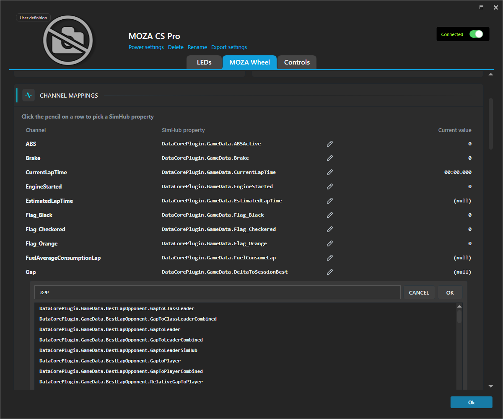
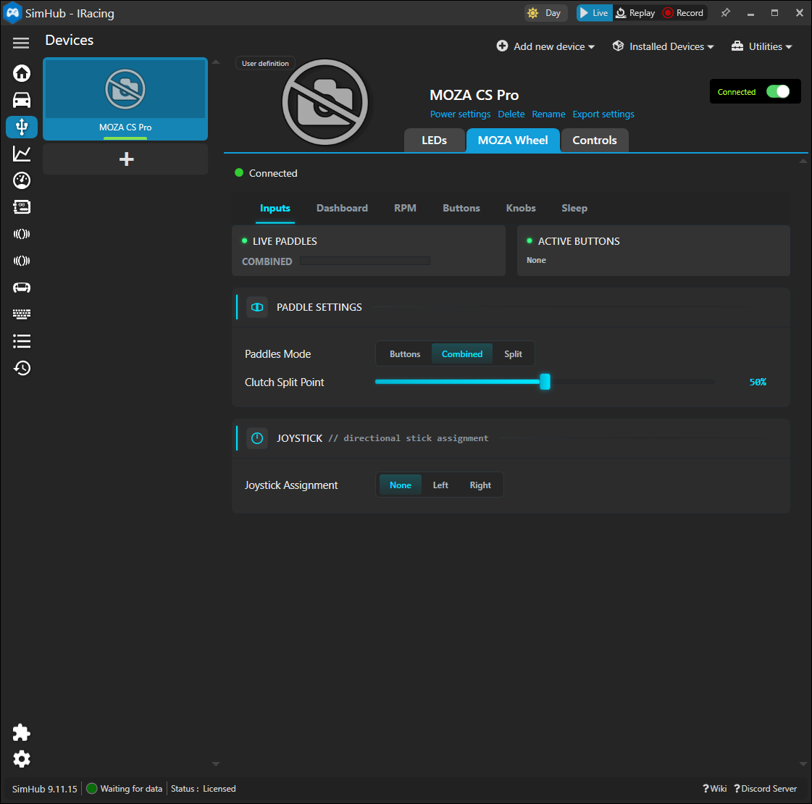
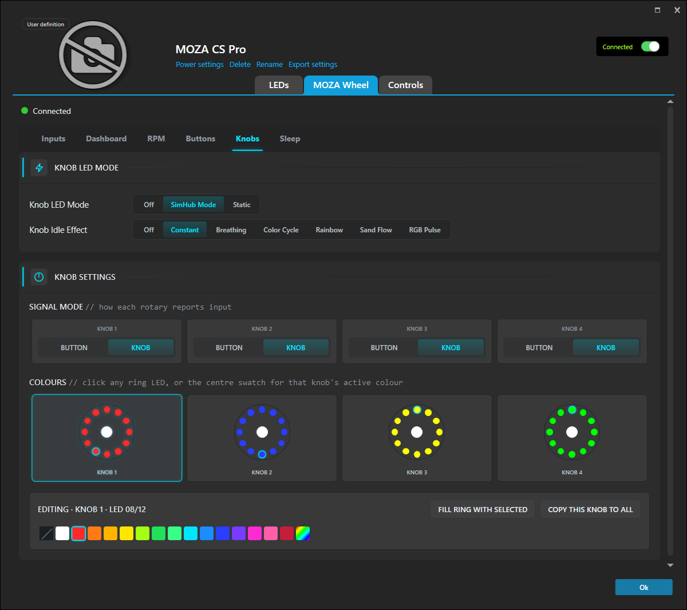

  

> [!IMPORTANT]
> **The Unofficial MOZA SimHub Plugin is now named AZOM.**

# AZOM

**The MOZA Bridge for SimHub** — an unofficial, open-source SimHub plugin for MOZA sim racing hardware.

> [!NOTE]
> MOZA is a registered trademark of Gudsen Technology Co., Ltd. This project is not affiliated with, endorsed by, or sponsored by MOZA or Gudsen Technology. All trademarks are the property of their respective owners.

> _A CS Pro with a custom Sparco rim running ATSR_

A SimHub plugin that provides complete replacement software for your MOZA hardware.

Built using the amazing work of [Boxflat](https://github.com/Lawstorant/boxflat), Linux MOZA control software.

> [!WARNING]
> If you [sponsor future development efforts](https://github.com/sponsors/giantorth) the money will just be used to buy more MOZA hardware.

## Why This Exists

MOZA makes excellent sim racing hardware, but their companion software — Pithouse — is Windows-only. Linux users have no official way to manage LED effects or stream telemetry to your wheel's dashboard. SimHub, on the other hand, runs on Linux (via Proton/Wine), opening the door for cross-platform hardware control with built-in telemetry support.

This plugin opens up MOZA hardware to the wider world of SimHub.  Drive your leds using [ATSR-EVO](https://github.com/ATSR-Alex/ATSR-Hub-EVO/) plugin.  Map any data point from the thousands in SimHub to display on your wheel dashboards.
The goal is to expand the functionality of MOZA devices to a wider audience by providing tools that work across multiple platforms.  

> [!IMPORTANT]
> **Close Pithouse before using this plugin.** Both applications communicate with MOZA hardware over the same serial port and cannot be open simultaneously. Pithouse must be fully closed (not just minimized) before SimHub can connect.

> [!CAUTION]
> **USE AT YOUR OWN RISK.** This software communicates directly with force feedback hardware capable of producing high torque output that can cause serious injury or property damage. This plugin is provided "as is", without warranty of any kind, express or implied. The authors accept no responsibility or liability for any damage to hardware, injury to persons, or any other loss arising from the use of this software. By using this plugin, you acknowledge the inherent risks of controlling force feedback devices via third-party software and accept full responsibility for any consequences.

## Custom Effects managed by Simhub

https://github.com/user-attachments/assets/f5e77a1b-4b85-438c-957e-18c45d22a216

https://github.com/user-attachments/assets/94ad3e6a-9ae0-46a2-8e2f-4f4343326414

_Thank you to a gracious alpha tester who provided these custom effect and dashboard videos._

## Installation

1. Download the latest `MozaPlugin_<version>.zip` from the [Releases](https://github.com/giantorth/moza-simhub-plugin/releases) page.
2. Extract `MozaPlugin.dll` into your SimHub installation directory. 

> Simhub defaults to `C:\Program Files (x86)\SimHub\`

Restart SimHub — the plugin appears under Settings > Plugins as "AZOM".

**Development builds.** The latest in-progress build from the `dev` branch is published as a pre-release: [MozaPlugin_dev.zip](https://github.com/giantorth/moza-simhub-plugin/releases/download/dev-latest/MozaPlugin_dev.zip). Expect bugs or broken features — use the stable release above if you need something reliable.

**Device setup:** Connect your hardware and restart SimHub. The plugin auto-detects connected devices (wheel model, dashboard) and deploys matching device definitions. A banner in the plugin settings panel will prompt you to restart SimHub, after which the devices appear under Devices ready to add. Requires SimHub 9.11.8+.

## This Plugin is Better With ATSR-EVO

 ATSR-Hub EVO uses a custom LED framework which allows for advanced telemetry and input driven effects and animations. Drive your wheel LEDs in incredibly advanced ways.  

## Discord

[Join the Discord](https://discord.gg/J4enw43e62) if you want to discuss features or development of this plugin.

## Videos

<table>
<tr>
<td width="50%" valign="top">

Guide about this plugin from a beta tester (español)

</td>
<td width="50%" valign="top">

Another video, available in español and english dubbing

</td>
</tr>
</table>
<!-- Generated by https://t.cuts.so/github/video -->

## Features

### SimHub Device Integration

MOZA wheels and dashboards register as native SimHub devices, appearing in SimHub's **Devices** section. This enables full control of your LEDs through SimHub's effects pipeline — no separate telemetry mode needed.

- **Per-Model Device Definitions** — Each new wheel attached will get a generated device definition with the LED layout baked in. Definitions are deployed automatically on first detection — just connect your hardware, restart SimHub, and add the device. Requires SimHub 9.11.8+
- **LED Effects System** — Use SimHub's full Button and Telemetry effects configuration UI (RPM indicators, flags, speed limiter animations, scripted effects, etc.) to control your wheel and dashboard LEDs
- **Per-Game Device Profiles** — SimHub's device profile system saves and restores LED effect configurations per game
- **Model-Aware Connection** — Only the device matching the currently connected wheel reports as connected. Swap wheels and the correct device activates automatically
- **Separate Wheel & Dashboard Devices** — Each registers independently with its own profile and LED configuration
- **Individual LED Effects** — SimHub's per-LED effects reach the hardware in both "Combined" and "Individual LEDs Only" (Exclusive) modes. The virtual driver exposes RPM + button LEDs as one contiguous strip (telemetry first, then buttons) so per-LED effects can target the whole sequence; knob ring LEDs are addressable via the Extra/encoders channel
- **Wheelbase Ambient LEDs** — R21/R25/R27-class wheelbases register as a separate "MOZA Wheel Base" SimHub device exposing the 18-LED ambient ring. Drive it from SimHub's effects pipeline, or use the device page for indicator state, brightness, standby animation (Constant/Breath/Cycle/Rainbow/Flow), sleep mode + timeout, and startup/shutdown colors. R9/R12 bases ship without the LED strip and do not expose this device
- **Per-Wheel Idle & Sleep Effects** — Each wheel's device page has RPM / Buttons / Knobs / Sleep tabs for the hardware's own onboard idle animations (Constant, Breathing, Color Cycle, Rainbow, Sand Flow, RGB Pulse), static RPM/flag/knob colors, and the sleep-light mode + color + standby timeout. These play locally on the wheel when SimHub isn't driving effects (game closed, telemetry paused). Sleep settings persist at the wheel level, not per game
- **360hz and LFE Support** — Supports native control SDK for games that require it (iRacing)

The plugin injects virtual LED drivers so SimHub's effects UI shows each device as connected, even though MOZA uses a proprietary serial protocol. The computed LED colors are forwarded to the hardware each frame.

SimHub contains many effects to choose from and this plugin supports any custom effects that target a device.

Tested:
- Old-protocol wheels (ES series)
- Multiple Bases
- New-protocol wheels (Vision GS / GS V2P / TSW / KS Pro / CS Pro / FSR V2)
- MOZA handbrake 
- Universal Hub (port enumeration + child-device routing)
- AB9 active shifter (mode + feel sliders)
- Dashboard telemetry + screen updates (confirmed on Vision GS, CS Pro, KS Pro, and FSR V2)
- Stand-alone dashboards (CM1 and CM2 Racing Dash, standalone-USB or bridged behind the wheelbase)

TBD:
- Older generation wheels not in the list below

### Dashboard Support

Wheels with an LCD dashboard (Vision GS, CS Pro, KS Pro, and FSR V2 confirmed; others likely work) can receive live telemetry from SimHub — speed, RPM, gear, lap times, fuel, tyre wear, and so on — streamed via MOZA's multi-tier binary telemetry protocol.

- **Auto-detect dashboard folder.** The plugin scans your Pithouse install for the `.mzdash` source folder; an "Auto-detect" button on the wheel device page picks it up in one click. Subfolders are searched recursively, so the dropdown shows every layout you've authored in the dashboard builder.
- **Hot-reload.** Pick a different layout in the Dashboard dropdown and the plugin re-negotiates the wheel's tier definitions and starts streaming the new channel set without restarting SimHub. If you pick the layout already loaded on the wheel, the plugin detects it and skips the renegotiation.
- **Channel mapping.** The wheel device page has a "Channel mappings" expander to override which SimHub property drives each dashboard channel. Type 3+ characters to search the live SimHub property list (substring, case-insensitive). Leave blank to use the plugin's built-in default mapping.
- **String channels.** Dashboards that include text fields (driver name, session type, position labels, etc.) are supported and encoded as UTF-8.
- **Firmware era.** The Options tab has a "Wheel firmware era" override (Auto / 2024 / 2025 / 2026).
- **Test pattern.** A "Send Test Pattern" button cycles all mapped channels through known values so you can verify a dashboard is wired up correctly without launching a game.

**Important caveats:**

- **SimHub dashboards are not supported.** MOZA wheels render their LCD through firmware using MOZA's proprietary dashboard format. This plugin only streams game data into that format — it cannot push SimHub dashboard templates, HTML overlays, or custom layouts to the screen. Continue using the official MOZA dashboard builder for layout work.

### Per-Game Profiles

All settings are stored per-game via SimHub's profile system and switch automatically when you launch a different game. A profile selector sits at the top of the plugin panel.

### Languages

The plugin UI is localized into **English, Deutsch, Ελληνικά, Español, Français, Italiano, Norsk bokmål, Русский, Tiếng Việt, and 简体中文** (10 languages). By default the plugin follows SimHub's own language setting (Settings > General > Culture in SimHub); if SimHub is set to a language the plugin doesn't ship yet, it falls back to your OS UI language, then English. A **Language** picker in the plugin's Options tab lets you override that auto-detection — useful if you want SimHub in one language and the MOZA pane in another.

All translations are embedded directly into `MozaPlugin.dll` — no per-culture satellite assemblies, no extra files to deploy. Translations live in `Resources/Strings.<culture>.resx`. PRs adding a new language are welcome — see the i18n section in [DEVELOPMENT.md](docs/DEVELOPMENT.md) for the four-step recipe.

### Hardware Configuration

The plugin panel (Settings > Plugins > AZOM) exposes read/write control of wheelbase, wheel, handbrake, pedal, and hub settings — rotation angle, FFB strength, damping, wheelbase/game effects, FFB equalizer, output curves, performance output mode, paddle/clutch/knob/stick modes, handbrake modes, pedal calibration, and hub port enumeration — mirroring what Pithouse offers. Tabs auto-show/hide based on what's connected (Base, Wheel, Handbrake, Pedals, AB9 Shifter, mBooster, Hub, Options, Wheel Files, SDK, About). The About tab dumps live wheel identity, dashboard state, and session info for bug reports, with serial numbers redacted by default.

The Universal Hub gets its own tab listing each connected port and the device attached to it, polled every 2 seconds.

The plugin also remembers the last-used wheelbase and AB9 COM ports across SimHub restarts, recovers serial connectivity after sleep/resume, and handles wheel hotswap (swap wheels mid-session and the device definition switches automatically once the new wheel reports its model).

**Gearshift bump.** A tactile pulse fires through the wheelbase on every SimHub-reported gear change, giving you a physical "thunk" through the wheel on each shift. Configurable in the Base tab.  Supports configurable debounce and suppress on neutral options.

### AB9 Active Shifter

Full configuration support for the MOZA AB9 active shifter, surfaced under its own "AB9 Shifter" tab when one is connected:

- **Mechanical layout** — 5+R, 6+R (two patterns), 7+R (two patterns), or Sequential.
- **Feel** — mechanical resistance, spring, natural damping, natural friction, and max output torque limit, each on a 0–100 slider.
- **Engine vibration** — intensity (0–100) and frequency (0–200 Hz) for engine-driven shaker effect.
- **Gear-shift vibration** — pulse intensity (0–100) on every shift.

### mBooster Pedals

MOZA mBooster pedal haptics get their own **mBooster** tab when one or more units are connected. Each unit is assigned a role (Throttle, Brake, or Clutch), and the plugin renders pedal haptic effects host-side from live telemetry:

- **Engine Vibration** — RPM-driven continuous vibration.

An experimental calibration section is also available per device.

### Diagnostics & Serial Capture

The About tab includes a **Serial traffic capture** section for bug reports:

- **Start capture** records every TX/RX serial frame (wheelbase + AB9 pipes) with millisecond timestamps in memory. Nothing is written to disk while capturing, and the buffer is wiped each time SimHub restarts.
- **Stop capture** reveals the captured frames inline (hex dump, one frame per line) and unlocks the export buttons. Per-direction labels (`T`/`R`) and pipe labels (`wheelbase` / `ab9`) make it easy to correlate with protocol docs.
- **Export bundle (ZIP)** writes a timestamped archive containing:
  - `manifest.txt` — bundle header (plugin version, OS, capture summary)
  - `serial-capture.txt` — TX/RX frame log
  - `diagnostics.txt` — snapshot of the About tab's diagnostic report (identity, dashboard state, session info)
  - `moza-log.txt` — every `[Moza]` log line emitted by the plugin since launch (pulled from the in-process `MozaLog` ring buffer, so flush cadence and SimHub log-file location don't matter)
- **Copy capture to clipboard** copies the frame log without exporting a file.

Use this when reporting protocol bugs or unexpected device behavior — attach the ZIP to the issue and the maintainers have everything needed to reproduce.

### SimHub Properties

The plugin exposes these properties for use in SimHub dashboards and overlays:

| Property | Type | Description |
|----------|------|-------------|
| `AZOM.BaseConnected` | bool | Wheelbase connection status |
| `AZOM.McuTemp` | double | MCU temperature (°C or °F, per the temperature-unit setting) |
| `AZOM.MosfetTemp` | double | MOSFET temperature (°C or °F, per the temperature-unit setting) |
| `AZOM.MotorTemp` | double | Motor temperature (°C or °F, per the temperature-unit setting) |
| `AZOM.BaseState` | int | Wheelbase state |
| `AZOM.FfbStrength` | int | FFB strength (%) |
| `AZOM.MaxAngle` | int | Max steering angle (degrees) |
| `AZOM.HidConnected` | bool | Whether a device HID surface is being read (live input is available) |
| `AZOM.SteeringAngle` | double | Live steering angle in degrees (0 = center, ± = each lock direction); 0 until max-angle is known |
| `AZOM.SteeringPosition` | double | Live steering as 0–100 (0 = full lock, 50 = center, 100 = full lock); -1 when unknown |
| `AZOM.Throttle` | int | Throttle pedal position (0–100) |
| `AZOM.Brake` | int | Brake pedal position (0–100) |
| `AZOM.Clutch` | int | Clutch pedal position (0–100) |
| `AZOM.Handbrake` | int | Handbrake position (0–100) |
| `AZOM.LeftPaddle` | int | Left analog paddle position (0–100) |
| `AZOM.RightPaddle` | int | Right analog paddle position (0–100) |
| `AZOM.CombinedPaddle` | int | Combined analog paddle axis position (0–100) |

These input properties are populated directly from the device HID surface, so they update live even when no game is running.

### SimHub Actions

The plugin registers these actions, bindable to wheel/controller buttons under SimHub's **Controls and events** (or to dashboard controls). They change the same settings as the sliders/toggles in the plugin UI, push to hardware immediately, and persist to the active profile.

Each *step* setting has four actions: `…Up` / `…Down` apply a fine step, and `…UpCoarse` / `…DownCoarse` apply a coarse step. Values clamp to the slider range.

| Action | Range | Fine | Coarse | Effect |
|--------|-------|------|--------|--------|
| `AZOM.FfbStrengthUp` / `…Down` / `…UpCoarse` / `…DownCoarse` | 0–100% | ±5 | ±10 | Wheelbase FFB strength |
| `AZOM.TorqueUp` / `…Down` / `…UpCoarse` / `…DownCoarse` | 50–100% | ±5 | ±10 | Wheelbase torque limit |
| `AZOM.RotationUp` / `…Down` / `…UpCoarse` / `…DownCoarse` | 90–2700° | ±90° | ±180° | Steering rotation (max angle) |
| `AZOM.Ab9EngineIntensityUp` / `…Down` / `…UpCoarse` / `…DownCoarse` | 0–100 | ±5 | ±10 | AB9 engine-vibration intensity |
| `AZOM.Ab9EngineFrequencyUp` / `…Down` / `…UpCoarse` / `…DownCoarse` | 0–200 Hz | ±10 | ±20 | AB9 engine-vibration frequency |
| `AZOM.Ab9GearShiftIntensityUp` / `…Down` / `…UpCoarse` / `…DownCoarse` | 0–100 | ±5 | ±10 | AB9 gear-shift vibration intensity |
| `AZOM.DisplayBrightnessUp` / `…Down` / `…UpCoarse` / `…DownCoarse` | 0–100% | ±5 | ±10 | Wheel screen display brightness |

| Action | Effect |
|--------|--------|
| `AZOM.DisplayBrightness0` … `AZOM.DisplayBrightness100` | Set wheel screen display brightness to a fixed level (0–100% in steps of 10) |
| `AZOM.WorkModeOff` | Turn off the wheelbase work mode (puts the base into standby) |
| `AZOM.WorkModeOn` | Turn on the wheelbase work mode (normal active state) |
| `AZOM.DashboardNext` | Switch the wheel's displayed dashboard to the next enabled slot (wraps around) |
| `AZOM.DashboardPrev` | Switch the wheel's displayed dashboard to the previous enabled slot (wraps around) |
| `AZOM.DashboardTelemetryToggle` | Toggle dashboard telemetry on/off for the active wheel page |
| `AZOM.DashboardTelemetryOn` | Enable dashboard telemetry for the active wheel page |
| `AZOM.DashboardTelemetryOff` | Disable dashboard telemetry for the active wheel page |
| `AZOM.DisplayToggle` | Toggle the wheel screen on/off (remembers the on-brightness so toggling back on restores it) |
| `AZOM.TestModeToggle` | Toggle telemetry test mode (synthetic signal sweep) for the active wheel page |
| `AZOM.ClearLeds` | Blank all wheel and dash LEDs |

## Building from Source

See [DEVELOPMENT.md](docs/DEVELOPMENT.md) for build instructions (Windows & Linux cross-compilation), CI/CD pipeline details, and full architecture reference.

Protocol reference: [docs/protocol/](docs/protocol/README.md). USB capture guide: [docs/usb-capture.md](docs/usb-capture.md). SimHub plugin API notes: [docs/simhub.md](docs/simhub.md).

